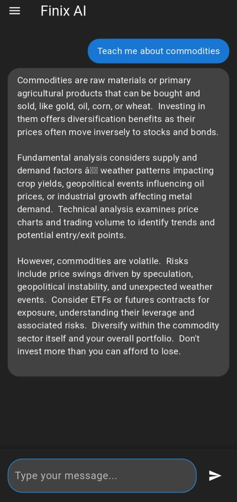
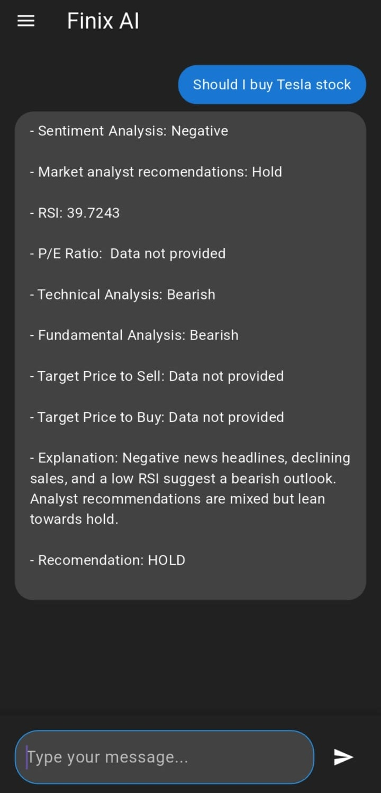

# FinixAI 📈🤖

**Your AI-Powered Financial Analyst & Investment Assistant**

FinixAI is a personal project that brings intelligent, real-time stock market insights directly to users through a conversational interface. Whether you're tracking stocks, crypto, or forex, FinixAI provides smart summaries, predictive analysis, and live alerts — all powered by AI and real-time data APIs.

## Table of Contents
- [Features](#-features)
- [Tech Stack](#️-tech-stack)
- [Project Structure](#-project-structure)
- [Screenshots](#-screenshots)
- [Prerequisites](#-prerequisites)
- [Getting Started](#-getting-started)
- [Installation](#-installation)
- [Download](#-download)
- [Tutorial](#-tutorial)
- [License](#-license)

## 🚀 Features

- **Natural Language Interface**: Ask FinixAI financial questions like “Should I invest in Tesla?” or “What’s the forecast for Apple stock?”
- **Live Market Data**: Real-time price tracking for stocks, crypto, and forex.
- **Smart Summaries**: AI-generated summaries of company financials, trends, and performance.
- **Market Alerts**: Get notified of significant price fluctuations or events.
- **Custom Watchlists**: Track and manage your favorite assets.
- **Predictive Analysis**: Data-driven AI insights into future performance (experimental).

## 🛠️ Tech Stack

- **Frontend**: Flutter
- **Backend**: Python (Serverless functions on Vercel)
- **AI Models**: gemini-1.5-flash
- **RAG Workflow**: Retrieval-Augmented Generation with in-memory vector store
- **Data Sources**: Finnhub, AlphaVantage, NewsAPI

## 📂 Project Structure

```
├── android
├── assets
│   └── images
├── build
├── ios
├── lib
│   ├── backend
│   │   ├── chatbot.py
│   │   ├── news.py
│   │   └── stock_data.py
│   ├── login
│   │   ├── login_page.dart
│   │   └── registration_page.dart
│   ├── utils
│   │   └── countrylist.dart
│   ├── widgets
│   │   └── app_drawer.dart
│   ├── chat_page.dart
│   ├── educate_page.dart
│   ├── home_page.dart
│   ├── main.dart
│   ├── profile_page.dart
│   └── team_page.dart
├── test
└── web
```

## 🖼️ Screenshots

| Homepage | Educator |
| :---: | :---: |
|  |  |
| **Advisor** | **Learn Online Page** |
|  |  |

## ✅ Prerequisites

Before you begin, ensure you have met the following requirements:
- You have installed the latest version of [Flutter](https://flutter.dev/docs/get-started/install)
- You have a Windows/Linux/Mac machine.
- You have a Vercel account for backend deployment.
- You have API keys for Finnhub, AlphaVantage, and NewsAPI.

## 🚀 Getting Started

To get started with FinixAI, follow these steps:

1. Clone the repository:
   ```bash
   git clone https://github.com/your-username/Finix.ai.git
   ```
2. Navigate to the project directory:
   ```bash
   cd Finix.ai
   ```
3. Install the dependencies:
    ```bash
    flutter pub get
    ```
4. Set up your environment variables for the backend by creating a `.env` file in the `lib/backend` directory with the following content:
    ```
    FINNHUB_API_KEY=your_finnhub_api_key
    ALPHA_VANTAGE_API_KEY=your_alpha_vantage_api_key
    NEWS_API_KEY=your_news_api_key
    ```
5. Run the app:
    ```bash
    flutter run
    ```

## 📦 Installation

> **Note**: This project is in development.

## 📲 Download

[Download the latest APK here](https://drive.google.com/file/d/1FsFy28LnntYg7O2KA5GKQdGYvqJaxo8D/view?usp=sharing)

## 📺 Tutorial

[Watch the video tutorial on YouTube](https://youtu.be/7Zu3MQ10d7U?si=VvfSZjrhiqJTUKHm)

## 📄 License

This project is licensed under the MIT License - see the [LICENSE.md](LICENSE.md) file for details.
